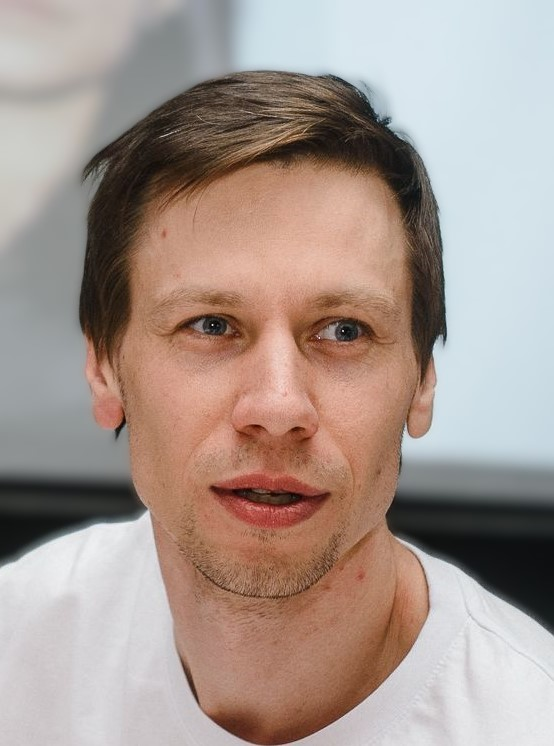

Резюме
=======
.. raw:: html

   

Общая информация
----------------
Мужчина, 33 года, родился 17 января 1991
Проживаю: Санкт-Петербург, м. Технологический институт 1

- **Имя**: Роман 
- **Профессия**: Технический писатель
- **Контакты**:

  - telegramm: https://t.me/LlamaTechWriter

Навыки
------

- **Технические навыки**:
  
  - Создание технической документации (API, руководства пользователя и др. документы).
  - Использование инструментов: Sphinx, Confluence, Microsoft Office.
  - Работа с языками: Markdown, reStructuredText, XML.

- **Мягкие навыки**:
  
  - Коммуникация с разработчиками и командой.
  - Внимание к деталям.
  - Способность работать в Agile-среде.

- **Дополнительная информация**:

  - Работа в команде 
  - Работа с большим объемом информации 
  - MS Visio
  - Electronic Workbench 
  - MS Office 
  - Работа с базами данных 
  - Git 
  - SQL
  - API Разработка технической документации 
  - AutoCAD Mathcad КОРТЭС
  - .rst 
  - Markdown 
  - BPMN 
  - UML 
  - Atlassian Confluence 
  - Atlassian Jira
  - Latex

- **Знание языков**:

  - Русский — Родной
  - Английский — B1 — Средний
  - Испанский — A1 — Начальный

Опыт работы — 11 лет 7 месяца
------------------------------
Последнее три места работы

Технический писатель в компании ARHITEX
++++++++++++++++++++++++++++++++++++++++++

**Период**: Ноябрь 2023 — настоящее время 1 год 3 месяца

**Технический писатель**

Группа бизнес анализа

Функциональные обязанности

- Сбор, обработка, анализ и систематизирование нормативных материалов для разработки технической документации;
- Разработка текстовой технической документации с элементами графики в рамках фиксированных нотаций и стандартов и требований Заказчика;
- Техническое редактирование информационных и нормативных материалов заказчика;
- Консультирование и обучение коллег и Заказчика в рамках своих компетенций;
- Участие в подготовке методических пособий для качественного обучения пользователей разрабатываемых продуктов;
- Участие в создании архива технической документации по проектам;
- Сопровождение развития специализированных систем для работы с бизнес-архитектурой;
- Оценка задач, связанных с созданием технической документации по функциональности системы на основе верхнеуровневых требований совместно со смежными подразделениями;
- Совершенствование внутренних бизнес-процессов;
- Выполнение других задач и поручений в рамках компетенций.

Достижения

- Составил Руководство пользователя для продукта компании на языке разметке .rst
- Составил Руководство администратора для продукта компании
- Участвовал в написании комплекта технической документации: Пояснительная записка;
- Описание автоматизируемых функций; Модель целевых процессов; Концепция миграции данных
- Участвовал в описание данных и условий (бизнес-правил)
- Разработал шаблон Space project для ведения проекта в Confluence
- Выполнил тестирование части функционала прототипа разрабатываемой системы
- Разработал Требования к структурным элементам и правила оформления пользовательской документации проекта (style guide)
- Выполнил описание математической модели проекта
- Собрал документ в Latex: "Постановка математической модели"
- Подготовил документацию по продуктам компании к заявлению в ФГИС Реестры ПО и регистрации ПрЭВМ И БД
- Сделал внутри компании предложение по развертыванию статического сайта с документацией продуктов компании

Ведущий специалист в компании АО "ВНИИЖТ"
++++++++++++++++++++++++++++++++++++++++++++++++++++++++

**Период**: Июнь 2020 — Ноябрь 2023 3 года 6 месяцев

**Ведущий специалист**

Обязанности

-Участие в разработке программы для расчета пропускной способности системы тягового
электроснабжения ОАО «РЖД» на роли главный технолог.
- Участие на всех стадиях и этапах создания АС ГОСТ Р 59793-2021.
- Взаимодействия с Front и back разработкой. (в своей деятельности использую Scrum методологию, но владею и другими подходами Agile)
- Разработка методических и нормативных документов, технической документации согласно ГОСТ 34, 19, 7.32
- Интервьюировании бизнес-экспертов и пользователей информационной систем.
- Согласование требований с заказчиком, для одинакового их восприятия как с заказчиком, так и разработчиками системы.
- Изучение и систематизация документации по проекту в части выделения процессов, подлежащих автоматизации.
- Анализ рисков и причин возникновения ошибок при разработке системы.
- Участие в научно-исследовательской работе центра. Выполнение работ в области научно-технической деятельности по проектированию, информационному обслуживанию, организации производства, труда и управления, метрологическому обеспечению, техническому контролю применительно к системам тягового электроснабжения.
-Разработка методических и нормативных документов, технической документации. Чтение и составление проектной документации и электрических схем.

Достижения

- Разработал техническое задание на разработку системы согласно ГОСТ 34.602-2020
- Подготовил технические алгоритмы для последующей автоматизации.
- Выполнил программу и методику испытаний тестирования разрабатываемой системы по ГОСТ Р 59792-2021, СТО РЖД 04.001.2-2021
- Составил Руководство пользователя
- Участвовал в написании комплекта технической документации: Руководство администратора базы данных; Описание информационной технологии; Описание комплекса программ; Руководство администратора системы; Руководство по инсталляции; Руководство по организации сопровождения.
- Проводил тестирование прототипа разрабатываемой системы.
- Определил роли пользователей и прав доступа.
- Выполнил обучение и сопровождение пользователей.
- Выполнил 3 научно-исследовательские работы (НИР)

Специалист в компании АО "ВНИИЖТ"
++++++++++++++++++++++++++++++++++

**Период**: Март 2019 — Июнь 2020 1 год 4 месяца

**Специалист**

Выполнение работ в области научно-технической деятельности по проектированию,
информационному обслуживанию, организации производства, труда и управления,
метрологическому обеспечению, техническому контролю применительно к системам тягового
электроснабжения.
Разработка методических и нормативных документов, техническую документацию, а также
предложения и мероприятия по осуществлению разработанных проектов и программ
Принятия участия в подготовке договорной документации.
Составление графика работ, заказы, заявки, инструкции, пояснительные записки, карты, схемы
и другую техническую документацию, а также установленную отчетность по утвержденным
формам и в установленные сроки.
Участие в работах по исследованию, разработке проектов и программ центра в проведении
мероприятий, связанных с испытаниями оборудования и внедрением его в эксплуатацию.
Чтение и составление проектной документации и электрических схем. а также выполнении
работ по стандартизации технических средств, систем, процессов, оборудования и материалов,
в рассмотрении технической документации и подготовке необходимых обзоров, отзывов,
заключений по вопросам выполняемой работы.

Образование
-----------

**Высшее**

2023 Санкт-Петербургский университет повышения квалификации и
профессиональной переподготовки

*Промышленность. Информационные технологии. Транспорт., Технический писатель
(специалист по технической документации в области информационных технологий)*

2013 Красноярский институт железнодорожного транспорта (филиал)
Иркутского государственного университета путей сообщения,
Красноярск

*Электроснабжение железных дорог , Электрический транспорт железных дорог*

Повышение квалификации, курсы
-------------------------------

- 2023 Цифровая трансформация в ОАО «РЖД», *ОАО «РЖД»*
- 2022 Экономика грузовых и пассажирских перевозок. *Акционерное общество «Научно-исследовательский институт железнодорожного транспорта»*
- 2021 5jpf «Основы программирования на языке Java», *НОУЧ ДПО УЦ «Сетевая академия», it разработка.*

Обучение
---------

- TechWriter Days -- Конференция технических писателей
- Онлайн курсы Stepik (Java базовый курс. Figma для слайдов. Введение в базы данных. GIT. Демоверсия курса «Аналитик данных». Docs as Code: пишем тексты как код)
- Яндекс Практикум. (Специалист по Data Science. Бесплатный курс «Основы работы с базамиданных и SQL»: онлайн-обучение с нуля. Основы математики для цифровых профессий. Основы работы с Git)

Дополнительная информация
--------------------------

- Женат, двое детей
- Права категории B стаж 15 лет
- Написание научных статей индексируемые в РИНЦ и Scopus.
- Интерес в области IT-иноваций, шахматы, горные лыжи

.. raw:: html

   <!-- Кнопка для распечатки -->
   <button id="print-button" style="background-color: #007bff; color: white; padding: 10px 20px; border: none; border-radius: 5px; cursor: pointer; margin-right: 10px;">
       Распечатать резюме
   </button>

   <!-- Кнопка для сохранения как PDF
   <button id="export-pdf" style="background-color: #28a745; color: white; padding: 10px 20px; border: none; border-radius: 5px; cursor: pointer; margin-right: 10px;">
       Сохранить как PDF
   </button> -->

   <!-- Ссылка для скачивания готового PDF
   <a href="../build/pdf/resume.pdf" download style="text-decoration: none; background-color: #ffc107; color: black; padding: 10px 20px; border-radius: 5px; display: inline-block;">
       Скачать готовое резюме
   </a> -->

   <!-- Подключение скриптов -->
   
   
   